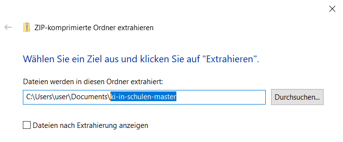
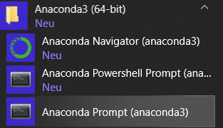
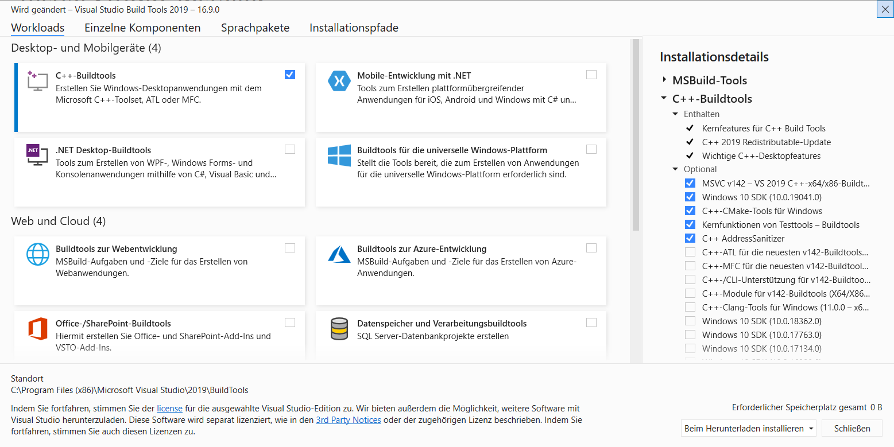

# Basisinstallation des Projektes auf Windows

Das Projekt wurde in 2020 auf Basis Python 3.7 entwickelt. Ein Funktionieren mit höheren/niedrigeren Python-Versionen wurde bisher nicht getestet. Python 3.7 ist bis 2023 durch Sicherheitsupdates unterstützt.

Da Windows 10 64bit sehr weit verbreitet ist, bezieht sich diese Installationsanleitung darauf, getestet wurde sie letztmals erfolgreich mit Windows 10 Pro 64bit Version 1909.

### Durchzuführende Schritte für Installation

#### Schritt 1 - Unser Projekt als ZIP-Archiv herunterladen

Quelle: https://github.com/telekom/ki-in-schulen/archive/master.zip

#### Schritt 2 - ZIP-Archiv entpacken

Dies geht im Windows Explorer per Rechtsklick auf die Zip-Datei. Beim anschließenden Dialog sollte man den im Bild blau markierten Pfad löschen, um eine zu tief verschachtelte Verzeichnisstruktur zu vermeiden.

Das resultierende Verzeichnis `ki-in-schulen-master` enthält alle für das Projekt notwendigen Dateien, die für den weiteren Installationsverlauf benötigt werden.

#### Schritt 3 - Python-Installation - Einleitung

Unser Projekt "Calliope-Rennspiel" wurde in der Programmiersprache __Python__ entwickelt, die für Experimente mit dem Thema Künstliche Intelligenz einen defacto Standard darstellt.

Für die Nutzung von Python-Programmen ist die Nutzung eines sogenannten "Umgebungsmanagers" wie Anaconda sehr empfohlen, da andernfalls schnell Inkompatibilitäten verschiedener Python-Paketversionen entstehen können.

Eine manuelle Installation von Python und den für das Projekt notwendigen Paketversionen ist möglich, aber aus Gründen des Komforts nicht empfohlen.

#### Schritt 4 - Download & Installation der Open Source Version ("Individual Edition") des Anaconda Python Umgebungsmanagers

Quelle: https://www.anaconda.com/products/individual

#### Schritt 5 - Erstellen der für das Projekt notwendigen Python-Umgebung mittels Anaconda (Befehl `conda`)

Nach der in Schritt 4 erfolgten Anaconda-Installation wird für die folgenden Schritte ein Anaconda-Prompt geöffnet, um die folgenden Befehle einzugeben:

__Basisvariante - ohne Orange__

`conda env create -f=.\ki-in-schulen-master\Calliope-Rennspiel\Python\conda-envs\ki-calliope-rennspiel-win10-x64-basis.yaml`

`conda activate ki-calliope-rennspiel-basis`

__Expertenvariante - mit Orange__

Voraussetzung für die Installation der Expertenvariante ist der Microsoft C++-Compiler `Visual Studio Build Tools`.

Quelle: https://visualstudio.microsoft.com/visual-cpp-build-tools/

Die Installation nur der "C++ Build Tools" mit den Standardoptionen ist ausreichend, wie auf folgendem Bild sichtbar:

Getestet wurde diese Installation zuletzt erfolgreich mit den Visual Studio Build Tools 2019 Version 16.9.0.

Die Installation der Expertenvariante mit Orange wird danach in einem Anaconda Prompt wie folgt durchgeführt:

`conda env create -f=.\ki-in-schulen-master\Calliope-Rennspiel\Python\conda-envs\ki-calliope-rennspiel-win10-x64-orange3.yaml`

`conda activate ki-calliope-rennspiel-orange3`

#### Schritt 6 - Test der Installation

__Test der Basisvariante - ohne Orange__

Ins Python Code-Verzeichnis wechseln:

`cd ki-in-schulen-master\Calliope-Rennspiel\Python`

Nacheinander ausführen und schauen ob Fehler auftauchen (dann ggf. notwendige Bibliotheken mit `conda install` oder `pip install` nachinstallieren).
Es sollten jeweils die Erläuterungsbildschirme für die Kommandozeilenparameter angezeigt werden, keine Fehlermeldungen.

`python ki-datenlogger.py`

`python ki-trainieren-sklearn.py`

`python ki-rennspiel.py`

__Test der Expertenvariante - mit Orange__

`orange-canvas` ausführen, darin nach Start die Projektdatei `ki-trainieren-orange.ows` laden.
