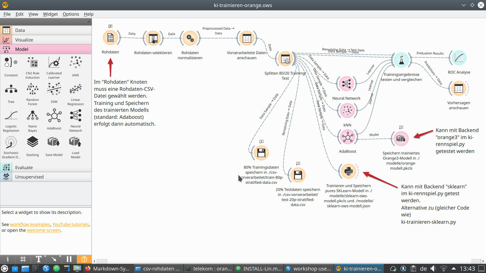

# Nutzeranleitung Einzelspielmodus (Basis)

Voraussetzung ist eine erfolgreich durchgeführte und getestete Installation der Expertenvariante unserers Projektes anhand der Installationsanleitungen:
* [Windows](./INSTALL-Win.md)
* [Linux](./INSTALL-Lin.md)
* [MacOS](./INSTALL-Mac.md)

Der "__Einzelspielmodus__" ist für Oberstufe empfohlen, und kann optional mit der Expertenvariante (Orange) erweitert werden. Dies hier ist die Anleitung für die Expertenvariante.

Die Nutzeranleitung für die Basisvariante ist hier zu finden:
* [Nutzeranleitung Einzelspielmodus - Basisversion](./Nutzeranleitung-Einzelspielmodus.md)

Im "Einzelspielmodus" kann __jeder Schüler seine eigene künstliche Intelligenz__ trainieren.

Mit der Expertenversion ist es möglich, verschiedene Algorithmen der künstlichen Intelligenz / des maschinellen Lernens auszuprobieren und gegeneinander zu vergleichen.

Im bereitgestellten Orange Workflow sind beispielsweise drei Varianten vorkonfiguriert, es können jedoch jederzeit weitere Algorithmen hinzugefügt werden:
* Neuronales Netzwerk
* k-Nearest Neighbor
* AdaBoost

### Durchführung "Einzelspielmodus"

#### Einleitung

Pro Schüler wird 1 "Rennspiel-Calliope" benötigt, der direkt per USB an den Rechner des Schülers angeschlossen wird.

#### Schritt 1 - Rennspiel installieren

Diesen Schritt muss jeder Schüler durchführen.

Hierzu muss ein Calliope Mini per USB an den Schülerrechner anschließen

__MakeCode-Variante__

* Die Datei `/ki-in-schulen-master/Calliope-Rennspiel/Makecode/rennspiel-funkgruppe1-makecode.hex` auf den per USB angeschlossenen Calliope Mini kopieren. (Die Funkgruppe ist im Einzelspielmodus egal)

__OpenRoberta-Variante__

* Die Datei `/ki-in-schulen-master/Calliope-Rennspiel/OpenRoberta/RaceCar-funkgruppe1.hex` auf den per USB angeschlossenen Calliope Mini kopieren. (Die Funkgruppe ist im Einzelspielmodus egal)

#### Schritt 2 - COM-Port des per USB angeschlossenen "Rennspiel-Calliopes" herausfinden

* Windows: via Gerätemanager, wird als "USB Serial Device" angezeigt

* Linux: `ls -al /dev/ttyACM*`

  ggf. Nutzer zur `dialout` Nutzergruppe hinzufügen, damit dieser auf den Calliope Mini auch zugreifen darf.

  `sudo usermod -aG <username> dialout`

  `sudo adduser <username> dialout`

#### Schritt 3 - Datensammel-Phase

* Auf jedem Schülerrechner ausführen: `python ki-datenlogger.py <COM-Port>` (COM-Port in Schritt 2 herausgefunden)

* __Startschuss__ für das Rennspiel auf dem "Rennspiel"-Calliope jedes Schülers. Die Schüler spielen das Rennspiel, so lange vorgegeben; dabei werden die Rohdaten per USB an den Schülerrechner übertragen. Am Ende ist eine beliebige Taste am Schülerrechner zu drücken, um das Datensammeln zu beenden und die Rohdaten in eine Datei zu speichern.

* Im Unterverzeichnis `csv-rohdaten` werden die Rohdaten abgelegt unter dem angezeigten Dateinamen, bspw. `ki-rennspiel-log-20210303111213.csv`

#### Schritt 4 - Trainingsphase (KI anlernen)

* Auf jedem Schülerrechner ausführen: `orange-canvas` (CSV-Datei in Schritt 3 gespeichert). Es startet das Programm Orange.

* Beim Start mit Open/Öffnen die Projektdatei `ki-trainieren-orange.ows` laden. (Diese liegt im Verzeichnis `ki-in-schulen-master/Calliope-Rennspiel/Python/`)

* In der grafischen Darstellung von links nach rechts sind die Schritte des Trainings dargestellt und können durch Doppelklicken auf die jeweiligen Knoten untersucht werden.

* Bei dem Knoten "Rohdaten" (links oben) kann die im vorigen Schritt 3 erzeugte CSV-Datei geladen werden.

* Danach läuft der Trainingszyklus automatisch, was durch ein Durchlaufen der roten Punkte durch den Graphen beobachtet werden kann.

* Standardmäßig trainiert das Orange Projekt ein __AdaBoost__ basiertes Modell. Das Projekt enthält auch Knoten für ein __neuronales netzwerk__ und ein __k nearest Neighbors (kNN)__ basiertes Modell. Weitere Algorithmen sind im Baukastensystem auf der linken Seite der Orange Nutzeroberfläche im Bereich "Models/Modelle" zu finden - fröhliches Experimentieren ist hier möglich!

* Am Ende des Trainings - egal welcher Algorithmus - wird im Verzeichnis `modelle` eine Datei namens `orange3-model.pkcls` erstellt.

__Optional__

* Das Orange Projekt enthält im Knoten "Trainieren und Speichern pures sklearn-Modell" auch das Python-Script der Basisvariante, sodass für entsprechend fortgeschrittene SuS auch entsprechender Einstieg in den Python-Code ermöglicht ist.

* Diese Python-Skripte erstellen im Verzeichnis `modelle` ebenfalls Modelldateien, die bereits aus der Basisvariante des Projektes bekannt sind.
  * Pickle-Modelldatei (Beispiel-Dateiname) `sklearn-ows-modell-20210302224418.pkcls`
  * JSON-Modelldatei (Beispiel-Dateiname) `sklearn-ows-modell-20210302224418.json`

####Schritt 5 - Testphase (KI die Steuerung übernehmen lassen)

__Variante A: IQ-Test auf Schülergruppenrechner__

* Auf jedem Schülerrechner ausführen: `python ki-rennspiel.py orange3 <PKCLS-Datei>` (PKCLS-Datei in Schritt 4 gespeichert)

* Um zu sehen, wie gut oder schlecht die angelernte KI steuert:

  * Turbo ausgeschaltet lassen (Standard)
  * KI spielen lassen durch Drücken von Taste __2__

* Da es sich um ein zufallsgesteuertes Rennspiel handelt, wird für eine Auswertung der KI-Leistung das Rennspiel 50-mal durch die KI gespielt und dann der Medianwert der erreichten Punktzahl angezeigt:

  * Turbo anschalten durch Drücken Taste __T__
  * KI spielen lassen durch Drücken von Taste __2__
  * 50 Episoden werden durch die KI gespielt
  * Medianwert der erreichten Punktzahl wird angezeigt.

__Variante B: IQ-Test auf Calliope Mini__

Das trainierte neuronale Netzwerk kann auch direkt auf dem Calliope Mini getestet werden. Dies erfordert jedoch die Durchführung der optionalen letzten Teilschritte im Schritt 4, die Nutzung des Python-Skript-Knotens. Ein Nutzung der weiteren KI-Algorithmen, die mit Orange möglich sind (beispielsweise kNN, AdaBoost etc.) ist auf dem Calliope Mini nicht umgesetzt.

Projektziel ist es, die "Hirntransplantation" des trainierten KI-Modells für die SuS über die Oberfläche auf https://makecode.calliope.cc nachvollziehbar zu machen; Stand März 2021 verhinderte jedoch ein Bug in Makecode diese Variante.

Daher wurde im Projekt ein temporärer Behelfsmechanismus implementiert:

* Auf dem Schülergruppenrechner ins Verzeichnis wechseln: `ki-in-schulen-master/Calliope-Rennspiel/Python/iq-test-calliope/`
* Auf dem Schülergruppenrechner ausführen: `python iq-test-erstellen.py -r <JSON-Modelldatei>` (Die JSON-Modelldatei ist eine in Schritt 4 erzeugte Modelldatei, bspw. `sklearn-ows-modell-20210302224418.json`)
* Die erzeugte Calliope Hex-Datei `iq-test-calliope.hex` kann auf einen Calliope Mini kopiert werden
* Die trainierte KI übernimmt die Steuerung im Rennspiel (manuelle Steuerung ist zusätzlich möglich)
