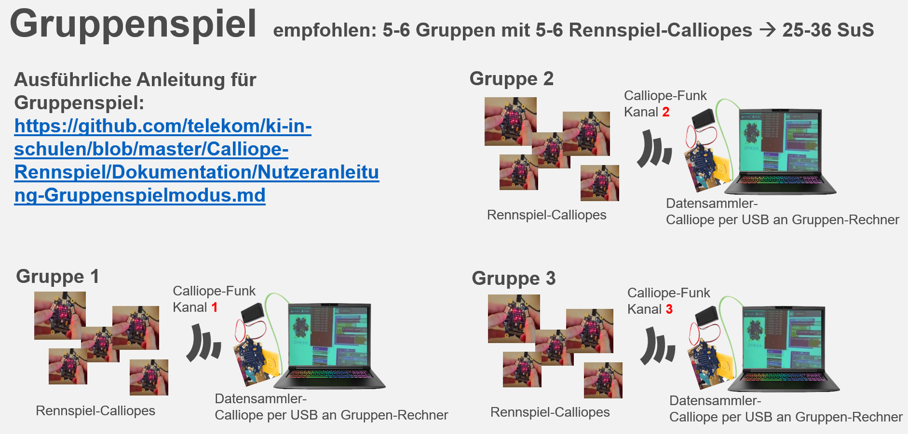

# Nutzeranleitung Gruppenspielmodus

Voraussetzung ist eine erfolgreich durchgeführte und getestete Basisinstallation unserers Projektes anhand der Installationsanleitungen:
* [Windows](./INSTALL-Win.md)
* [Linux](./INSTALL-Lin.md)
* [MacOS](./INSTALL-Mac.md)

### Durchführung "Gruppenspielmodus"

#### Einleitung

Pro Schülergruppe wird 1 "Datensammler-Calliope" benötigt, zu dem mehrere "Rennspiel-Calliopes" ihre Rohdaten per Funk senden können. Jede Schülergruppe erhält hierfür einen eigenen Funkkanal, um die Robustheit des Workshops zu erhöhen.

#### GUI (Grafische Nutzeroberfläche)

Seit Release "Speedy" (19.12.2022) können die Schritte 1 bis 6A statt manuell bzw. via Kommandozeile auch via einer komfortablen grafischen Nutzeroberfläche (GUI) durchgeführt werden (Stand Oktober 2023 nur für Windows und Linux verfügbar).

Dazu im Unterverzeichnis `/ki-in-schulen-master/Calliope-Rennspiel/Python/` folgenden Befehl ausführen: `python ki-gui-win.py` oder `python ki-gui-lin.py` 

Die unten beschriebenen Schritte sind dann entsprechend über die Menüpunkte des erscheinenden Fenster nutzbar.

#### Schritt 1 - Rennspiel auf den Calliope minis der Schüler installieren

Diesen Schritt mit angepasster Funkgruppe (__funkgruppe1__, __funkgruppe2__, ...) wiederholen, bis alle "Rennspiel-Calliopes" für alle Schüler aller Schülergruppen installiert sind.

Für die Installation wird pro Schüler der Schülergruppe jeweils ein Calliope mini per USB an den Schülergruppenrechner angeschlossen und dann das Rennspiel installiert:

*MakeCode-Variante*

* Die Datei `/ki-in-schulen-master/Calliope-Rennspiel/Makecode/rennspiel-funkgruppe1-makecode.hex` auf den per USB angeschlossenen Calliope mini kopieren

*OpenRoberta-Variante*

* Die Datei `/ki-in-schulen-master/Calliope-Rennspiel/OpenRoberta/rennspiel-openroberta.hex` auf den per USB angeschlossenen Calliope mini kopieren

#### Schritt 2 - Datensammler pro Schülergruppe installieren

Diesen Schritt mit angepasster Funkgruppe (__funkgruppe1__, __funkgruppe2__, ...) wiederholen, bis die gewünschte Anzahl der Schülergruppen erreicht ist.
* Hinweis: Bei der *OpenRoberta-Variante* kann die Funkgruppe beim Start des Datensammlers per Taste gewählt werden.

Der "Datensammler-Calliope" wird nun an einen USB-Port des Schülergruppenrechners angeschlossen und bleibt dort angeschlossen.

*MakeCode-Variante*

* Die Datei `/ki-in-schulen-master/Calliope-Rennspiel/Makecode/datensammler-funkgruppe<x>-makecode.hex` auf den per USB angeschlossenen Calliope mini kopieren

*OpenRoberta-Variante*

* Die Datei `/ki-in-schulen-master/Calliope-Rennspiel/OpenRoberta/datensammler-openroberta.hex` auf den per USB angeschlossenen Calliope mini kopieren

#### Schritt 3 - COM-Ports der per USB angeschlossenen "Datensammler-Calliopes" herausfinden

* Windows: via Gerätemanager, wird als "USB Serial Device" angezeigt

* Linux: `ls -al /dev/ttyACM*`

  Unter Linux ist ggf. der Projektnutzer zur `dialout` Nutzergruppe hinzufügen, damit dieser auf den Calliope mini auch zugreifen darf.

  `sudo usermod -aG <username> dialout`

  `sudo adduser <username> dialout`

#### Schritt 4 - Datensammel-Phase

* Auf jedem Schülergruppenrechner ausführen: `python ki-datenlogger.py <COM-Port>` (COM-Port in Schritt 3 herausgefunden)

* __Startschuss__ für das Rennspiel auf den "Rennspiel"-Calliopes der Schülergruppen. Schüler spielen das Rennspiel, so lange vorgegeben; dabei werden die Rohdaten per Funk an den "Datensammler-Calliope" übertragen. Am Ende ist eine beliebige Taste am Schülergruppenrechner zu drücken, um das Datensammeln zu beenden und die Rohdaten in eine Datei zu speichern.

* Im Unterverzeichnis `csv-rohdaten` werden die Rohdaten abgelegt unter dem angezeigten Dateinamen, bspw. `ki-rennspiel-log-20210303111213.csv`

#### Schritt 5 - Trainingsphase (KI anlernen)

* Auf jedem Schülergruppenrechner ausführen: `python ki-trainieren-sklearn.py <CSV-Datei>` (CSV-Datei in Schritt 4 gespeichert)

* Im Unterverzeichnis `modelle` wird ein trainiertes neuronales Netzwerk abgelegt unter dem angezeigten Dateinamen, bspw. `sklearn-py-modell-20210302220807.pkcls` und `sklearn-py-modell-20210302220807.json`

#### Schritt 6 - Testphase (KI die Steuerung übernehmen lassen: "IQ-Test" für die KI)

*Variante A: IQ-Test auf Schülergruppenrechner*

* Auf jedem Schülergruppenrechner ausführen: `python ki-rennspiel.py sklearn <PKCLS-Datei>` (PKCLS-Datei in Schritt 5 gespeichert)

* Um zu sehen, wie gut oder schlecht die angelernte KI steuert:

  * Turbo ausgeschaltet lassen (Standard)
  * KI spielen lassen durch Drücken von Taste __2__

* Da es sich um ein zufallsgesteuertes Rennspiel handelt, wird für eine Auswertung der KI-Leistung das Rennspiel 50-mal durch die KI gespielt und dann der Medianwert der erreichten Punktzahl angezeigt:

  * Turbo anschalten durch Drücken Taste __T__
  * KI spielen lassen durch Drücken von Taste __2__
  * 50 Episoden werden durch die KI gespielt
  * Medianwert der erreichten Punktzahl wird angezeigt.

*Variante B: IQ-Test auf Calliope mini*

Das trainierte neuronale Netzwerk kann auch direkt auf dem Calliope mini getestet werden.

Projektziel ist es, dies für die SuS über die Oberfläche auf https://makecode.calliope.cc nachvollziehbar zu machen; Stand März 2021 verhinderte jedoch ein Bug in Makecode diese Variante.

Daher wurde im Projekt ein temporärer Behelfsmechanismus implementiert:

* Auf dem Schülergruppenrechner ins Verzeichnis wechseln: `ki-in-schulen-master/Calliope-Rennspiel/Python/iq-test-calliope/`
* Auf dem Schülergruppenrechner ausführen: `python iq-test-erstellen.py -r <JSON-Modelldatei>` (Die JSON-Modelldatei ist eine in Schritt 5 erzeugte Modelldatei, bspw. `sklearn-py-modell-20210302220807.json`)
* Die erzeugte Calliope Hex-Datei `iq-test-calliope.hex` kann auf einen Calliope mini kopiert werden
* Die trainierte KI übernimmt die Steuerung im Rennspiel (manuelle Steuerung ist zusätzlich möglich)
