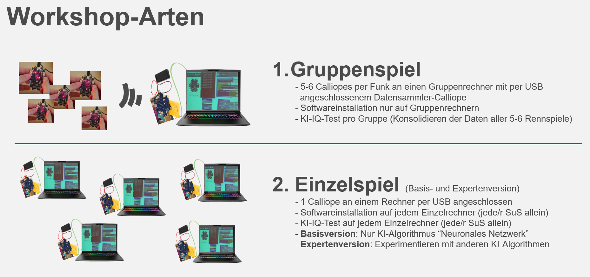

## Dokumentation

Um diesen Workshop an Schulen durchzuführen, stellen wir folgende Dokumentation bereit:

### Projektüberblick (Einstiegsdokument - lehrkräftefokussiert)

Präsentation, adressiert an Lehrkräfte, mit Erläuterung des Projekthintergrund und Ideen zum Einbau in Informatik-Curricula
* PDF [Calliope-Rennspiel - Künstliche Intelligenz leicht erklärt - Projektbeschreibung](./Calliope-Rennspiel%20-%20Kuenstliche%20Intelligenz%20leicht%20erklaert%20-%20Projektbeschreibung.pdf)
* ODP [Calliope-Rennspiel - Künstliche Intelligenz leicht erklärt - Projektbeschreibung](./Calliope-Rennspiel%20-%20Kuenstliche%20Intelligenz%20leicht%20erklaert%20-%20Projektbeschreibung.odp)

### Präsentation für Schülerinnen und Schüler

Präsentation, adressiert an SuS, zur Nutzung im Unterricht
* PDF [Calliope-Rennspiel - Künstliche Intelligenz leicht erklärt - Workshopfolien](./Calliope-Rennspiel%20-%20Kuenstliche%20Intelligenz%20leicht%20erklaert%20-%20Workshopfolien.pdf)
* ODP [Calliope-Rennspiel - Künstliche Intelligenz leicht erklärt - Workshopfolien](./Calliope-Rennspiel%20-%20Kuenstliche%20Intelligenz%20leicht%20erklaert%20-%20Workshopfolien.odp)

### Installationsanleitungen

* [Windows](./INSTALL-Win.md)
* [Linux](./INSTALL-Lin.md)
* [MacOS](./INSTALL-Mac.md)

### Nutzeranleitungen

Ein Workshop kann im "__Einzelspielmodus__" oder im "__Gruppenspielmodus__" durchgeführt werden.

Der "__Gruppenspielmodus__" ist für Unter- und Mittelstufe empfohlen aufgrund der weniger aufwändigen Installation. Im "Gruppenspielmodus" wird __pro Schülergruppe eine künstliche Intelligenz trainiert__. Hierfür ist eine Basisinstallation auf einem Schülergruppenrechner erforderlich, damit Daten pro Schülergruppe auf diesem gesammelt werden können.

Der "__Einzelspielmodus__" ist für Oberstufe empfohlen, und kann optional mit einer Expertenvariante erweitert werden, die den SuS umfangreichere Experimentier- und Lernmöglichkeiten im Thema bietet. Im "Einzelspielmodus" kann __jeder Schüler seine eigene künstliche Intelligenz__ trainieren. Dafür benötigt jeder Schüler mindestens eine Basisinstallation auf seinem Schülerrechner. Optional kann die Expertenvariante mit Orange installiert werden, mittels derer verschiedene Varianten künstlicher Intelligenz miteinander verglichen werden können.

* [Nutzeranleitung Gruppenspielmodus](./Nutzeranleitung-Gruppenspielmodus.md)
* [Nutzeranleitung Einzelspielmodus - Basisversion](./Nutzeranleitung-Einzelspielmodus.md)
* [Nutzeranleitung Einzelspielmodus - Expertenversion mit Orange](./Nutzeranleitung-Einzelspielmodus-Orange.md)
