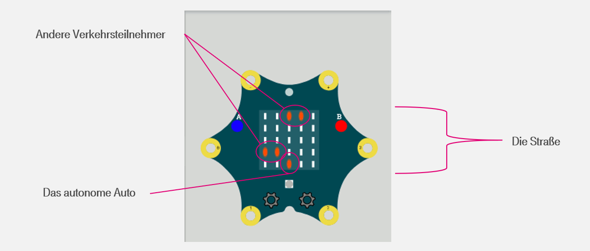
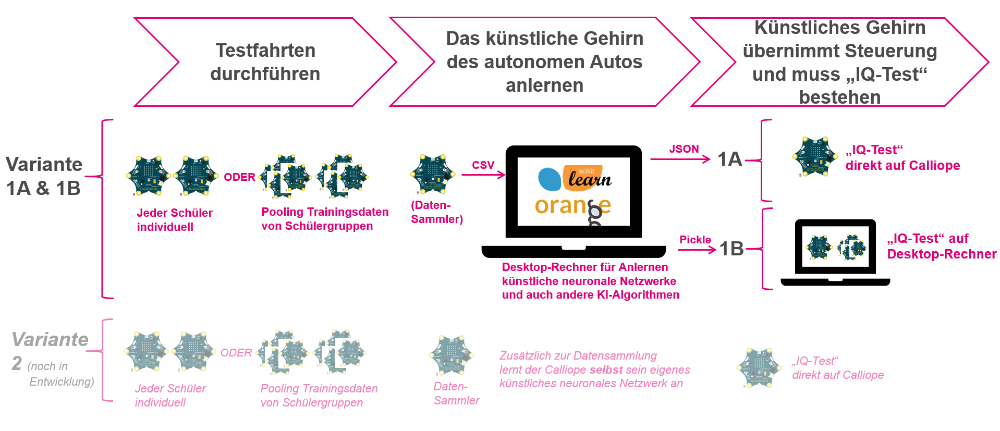

<h1 align="center">
    Autonomes Fahren mit dem Calliope mini
</h1>

  <a href="#einleitung">Einleitung</a> •
  <a href="#dokumentation">Dokumentation</a> •
  <a href="#los-geht's!">Los geht's!</a> •

## Einleitung

Jeder kennt Autos. Viele Schülerinnen und Schüler (SuS) spielen Autorennen, ob nun in der realen Welt in einer Seifenkiste ;-), oder virtuell mit Autorennspiel-Apps und -Computerspielen. Dementsprechend einfach ist es auch zu vermitteln, was "Autonomes Fahren" bedeutet: Nicht mehr der Mensch steuert das Auto, sondern das "Computerhirn" des dann "autonomen" Autos.

Daher eignet sich das Szenario "Autonomes Fahren" ganz besonders für einen KI-Workshop für SuS, eben weil es so intuitiv vermittelbar ist. Daran knüpft sich nämlich für die SuS automatisch die Frage, wie denn das "Computerhirn" des autonomen Autos lernt, gut Auto zu fahren? Ein Mensch geht in die Fahrschule... Aber was macht das autonome Auto? Hier setzt der Workshop an.

SuS bringen in einem Workshop einem “autonomen Auto” das selbständige (autonome) Fahren bei, indem sie einen Calliope “künstlich intelligent” machen, sodass er autonom Hindernissen auf der Straße ausweichen kann. Dies zur Erhöhung der Motivation durch „Gamification"-Elemente.

## Dokumentation

Um die Durchführung eines solchen Workshops an Schulen zu unterstützen, stellen wir folgende Dokumentation bereit:

[Dokumentation](./Dokumentation)

### Los geht's!

Folgendes Vorgehen bei der Einarbeitung in das Projekt ist empfohlen:

1. Die an Lehrkräfte adressierte Präsentation (ODP & PDF verfügbar) durchlesen, um einen Überblick zu erhalten, wie die verschiedenen Softwarekomponenten zusammenhängen und welche Möglichkeiten bestehen, die Elemente in einem Informatik-Curriculum zu nutzen
2. Der Installationsanleitung folgen und einen oder mehrere Schul-Rechner "fit" machen für die Projektsoftware (alles ist Python-basiert)
3. Der Nutzungsanleitung folgen, um einen Calliope mini künstlich intelligent zu machen.

Ergänzende Schritte

4. Die an SuS adressierte Präsentation (ODP & PDF verfügbar) ermöglicht einen SuS-gerechten Einstieg in das Thema "Künstliche Intelligenz" mit einer Überleitung in das KI-Szenario dieses Projektes (Autonomes Fahren)
5. Die Expertenversion des Projektes - empfohlen für Oberstufe - ermöglicht die vergleichende Betrachtung verschiedener Algorithmen im Bereich Künstliche Intelligenz

Folgende Übersicht fasst den Projektablauf & Projektvarianten übersichtlich zusammen:

### Erläuterung zum Projekt "pxt-ki-in-schulen"

Das trainierte neuronale Netzwerk kann auch direkt auf dem Calliope Mini getestet werden. Dies ermöglicht den SuS, ihren Lernerfolg (Training="Anlernen" eines autonom fahrenden Autos) direkt auf dem Calliope Mini zu beobachten, statt nur - relativ abstrakt - auf einem Desktop-Rechner.

Das Telekom Open Source Github Projekt https://github.com/telekom/pxt-ki-in-schulen gehört ebenfalls zum Calliope-Rennspiel-Projekt. Es stellt für Calliope Makecode "Bausteine" zur Nutzung eines künstlichen neuronalen Netzes auf einem Calliope Mini bereit (Implementierung einer schlanken Version künstlicher neuronaler Netze für den Calliope Mini).

Projektziel ist es, die "Hirntransplantation" ;-) eines trainierten KI-Modells für die SuS über die Oberfläche auf https://makecode.calliope.cc nachvollziehbar zu machen; Stand März 2021 verhinderte jedoch ein Bug in Makecode diese Variante.

Daher wurde im Projekt ein temporärer Behelfsmechanismus implementiert, der in den Nutzeranleitungen entsprechend referenziert ist.
